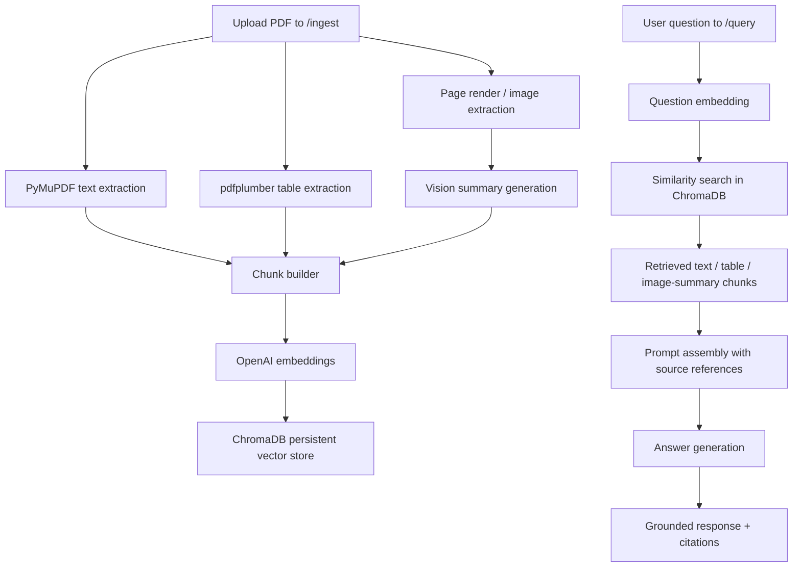

# Supplier Quality Manual Multimodal RAG

A FastAPI-based multimodal Retrieval-Augmented Generation (RAG) project for supplier-quality teams working with long automotive supplier manuals. This version is configured around the included **3M AASD (Automotive) Supplier Quality Manual, Rev. 6** and uses refreshed prompts, updated documentation, and a redesigned frontend.

---

## Problem Statement

Supplier-quality teams often work from dense PDF manuals instead of structured datasets. Important requirements may be spread across narrative sections, tables, approval rules, calibration expectations, PPAP notes, packaging instructions, and nonconformance procedures. Manually searching those documents is slow and error-prone.

This project solves that problem with a local multimodal RAG workflow. A user uploads a supplier-quality PDF, the system extracts text, tables, and page-level visual context, stores them in a searchable vector index, and then answers grounded questions with page-linked source chunks. The included sample document is the **3M AASD Supplier Quality Manual (Rev. 6)**.

Typical questions supported by the system include:

- What certification does 3M recommend for each supplier type?
- What must be included in the RMIF or HMIF submission?
- Which changes require written approval before production implementation?
- What traceability, barcode, and labeling requirements apply to shipments?
- What happens when nonconforming outputs trigger a SCAR or controlled shipping action?

---

## Architecture Overview



### Design notes

- Text, tables, and image-derived summaries are stored as separate chunk types.
- Page visuals are summarized before embedding so layout-heavy pages remain retrievable.
- ChromaDB stores chunk content together with filename, page number, chunk type, and document ID.
- Query responses return both the generated answer and the supporting source references.

---

## Technology Choices

### FastAPI
The backend is implemented in FastAPI because it is lightweight, easy to document, and provides a built-in `/docs` interface for demo use.

### PyMuPDF + pdfplumber
PyMuPDF is used for text extraction, page rendering, and image access. pdfplumber is used alongside it to extract table-like structures from PDFs.

### OpenAI models
OpenAI models are used for embeddings, answer generation, and visual summarization so the project keeps a consistent multimodal stack.

### ChromaDB
ChromaDB is used as a local persistent vector store, which keeps the project simple to run on a laptop without extra database infrastructure.

---

## Repository Structure

```text
automotive-supplier-quality-rag/
├── README.md
├── requirements.txt
├── .env.example
├── main.py
├── debug_ingest.py
├── frontend/
│   └── index.html
├── sample_documents/
│   ├── 3m_aasd_supplier_quality_manual_rev6.pdf
│   └── README.md
├── screenshots/
│   ├── README.md
│   └── .gitkeep
├── scripts/
│   └── generate_sample_pdf.py
├── src/
│   ├── api/
│   ├── ingestion/
│   ├── models/
│   ├── retrieval/
│   └── utils/
├── text_query.json
├── table_query.json
├── image_query.json
└── three_m_q1.json
```

---

## Included Sample Dataset

The repository now ships with:

- `3m_aasd_supplier_quality_manual_rev6.pdf` — 3M AASD (Automotive) Supplier Quality Manual, Rev. 6.

This document is a strong demo source because it includes:

- supplier type and certification guidance,
- calibration and training requirements,
- PPAP and prototype controls,
- RMIF/HMIF, SoC, REACH, GADSL, and conflict minerals declarations,
- lot traceability, barcode, packaging, and labeling expectations,
- SCAR, containment, and controlled shipping guidance.

---

## Setup

### 1. Create and activate a virtual environment

Windows PowerShell:

```powershell
python -m venv .venv
.\.venv\Scripts\Activate.ps1
```

### 2. Install dependencies

```powershell
pip install -r requirements.txt
```

### 3. Configure environment variables

Copy `.env.example` to `.env` and update the API key:

```powershell
copy .env.example .env
```

Then edit `.env` and set:

```env
OPENAI_API_KEY=your_actual_key_here
```

### 4. Run the application

```powershell
uvicorn main:app --reload
```

Open the app at:

- Frontend: `http://127.0.0.1:8000/`
- Swagger: `http://127.0.0.1:8000/docs`

---

## Example Flow

### Ingest the included sample PDF

```powershell
curl.exe -X POST "http://127.0.0.1:8000/ingest" `
  -F "file=@sample_documents\3m_aasd_supplier_quality_manual_rev6.pdf"
```

### Query the document

```powershell
$body = @{ question = "What certification does 3M recommend for an Automotive Intent Supplier?" } | ConvertTo-Json
Invoke-RestMethod -Uri "http://127.0.0.1:8000/query" -Method Post -ContentType "application/json" -Body $body
```

---

## Example JSON Prompts

- `text_query.json` → certification recommendation question
- `table_query.json` → supplier type and certification table question
- `image_query.json` → packaging and labeling requirement question
- `three_m_q1.json` → quick starter query for the included manual

---

## Notes

- Delete the local `data/chroma_db` folder if you want a clean index before a new demo run.
- Ingest only one sample PDF at a time during screenshots or presentations to keep retrieval results clean.
- The project can ingest other supplier manuals, but the included prompts and screenshots are tailored to the 3M document.
